# Comparaison des vitesses d'exécution des algorithmes de tri

## Introduction

Dans ce document, nous allons comparer la performance de quatre algorithmes de tri : **tri par sélection**, **tri par insertion**, **tri fusion** et **tri rapide**. L'objectif est de mesurer et d'analyser leurs vitesses d'exécution en fonction de la taille des données.
Chaque mesure a été réalisé grâce au fichier tris.py dans lequel chaque tri est implémenté et le programme principal de mesure est décris.
## Algorithmes étudiés

### 1. Tri par sélection
Le tri par sélection consiste à parcourir la liste pour trouver le plus petit élément afin de le placer en première position, puis à parcourir à nouveau la liste pour trouver le deuxième plus petit élément et le placer en deuxième position, et ainsi de suite jusqu'à ce que l'intégralité du tableau soit triée.
  
- **Complexité Temps** : O(n²)  
- **Complexité Mémoire** : O(1)  
- **Avantages** : Simple à implémenter, efficace pour les petites listes.  
- **Inconvénients** : Lent sur les grandes listes.    
  
```pseudo
  procédure tri_selection(tableau t)
      n ← longueur(t) 
      pour i de 0 à n - 2
          min ← i       
          pour j de i + 1 à n - 1
              si t[j] < t[min], alors min ← j
          fin pour
          si min ≠ i, alors échanger t[i] et t[min]
      fin pour
  fin procédure
```
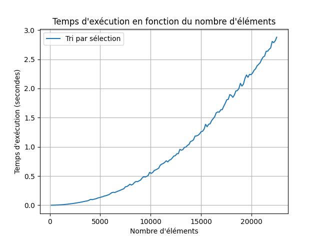
Sur ce graphique on observe bien l'allure quadratique de la courbe qui met environs 0,5 secondes à trier une liste de 10 000 éléments mais aussi 2,25 secondes à trier une liste de 20 000 éléments, soit presque 4 fois plus longtemps qu'un algorithme linéaire

### 2. Tri par insertion

Le tri par insertion fonctionne en construisant progressivement une liste triée en insérant un élément à la fois dans sa position correcte.

- **Complexité Temps** : O(n²)
- **Complexité Mémoire** : O(1)
- **Avantages** : Simple à implémenter, efficace pour les petites listes.
- **Inconvénients** : Lent sur les grandes listes. 
```pseudo
  procédure tri_insertion(tableau T)
  
       pour i de 1 à taille(T) - 1

            # mémoriser T[i] dans x
            x ← T[i]                            

            # décaler les éléments T[0]..T[i-1] qui sont plus grands que x, en partant de T[i-1]
            j ← i                               
            tant que j > 0 et T[j - 1] > x
                     T[j] ← T[j - 1]
                     j ← j - 1

            # placer x dans le "trou" laissé par le décalage
            T[j] ← x 
```
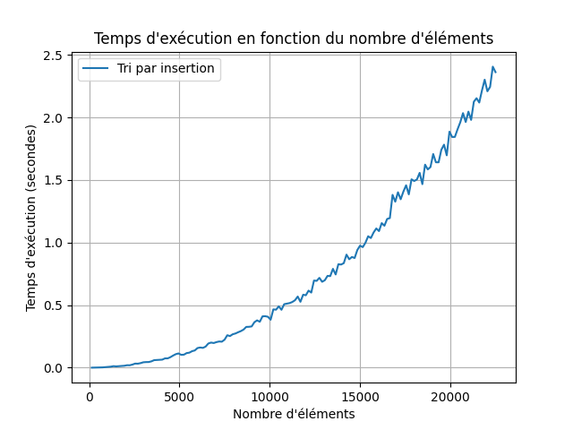
Cette courbe a la même allure que celle du tri par sélection mais il est nettement plus rapide, là oû le tri par sélection triais une liste de 20 000 éléments en 2,25 secondes, le tri par insertion met quant à lui environs 1,7 secondes.
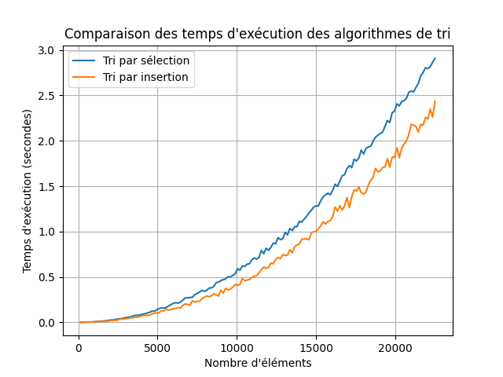


### 3. Tri Fusion

Le tri fusion consiste comme son nom l'indique en la fusion de petite liste triée chacune séparemment en utilisant la récursivité.
- **Complexité Temps** : O(nlog(n))
- **Complexité Mémoire** : O(n)
- **Avantages** : Efficace sur les grandes listes.
- **Inconvénients** : Nécessite de la mémoire supplémentaire et "lent" sur les petites listes. 

```pseudo 
entrée : un tableau T
sortie : une permutation triée de T
fonction triFusion(T[1, …, n])
      si n ≤ 1
              renvoyer T
      sinon
              renvoyer fusion(triFusion(T[1, …, n/2]), triFusion(T[n/2 + 1, …, n]))
```
```pseudo 
entrée : deux tableaux triés A et B
sortie : un tableau trié qui contient exactement les éléments des tableaux A et B
fonction fusion(A[1, …, a], B[1, …, b])
      si A est le tableau vide
              renvoyer B
      si B est le tableau vide
              renvoyer A
      si A[1] ≤ B[1]
              renvoyer A[1] ⊕ fusion(A[2, …, a], B)
      sinon
              renvoyer B[1] ⊕ fusion(A, B[2, …, b])
```
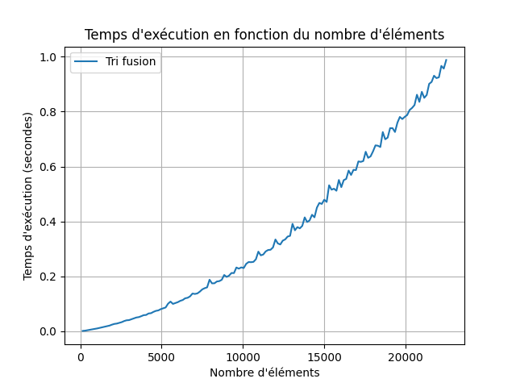
La pente de cette courbe est moins abrupte que celle des tris par sélection et par insertion, car le tri fusion a une complexité inférieure. Cependant, sur de petites listes, le tri par insertion peut être plus rapide. Il existe tout de même un point pivot à partir duquel, pour un nombre suffisamment grand d'éléments, le tri fusion devient plus performant que le tri par insertion, en raison de sa meilleure complexité pour les grandes entrées.
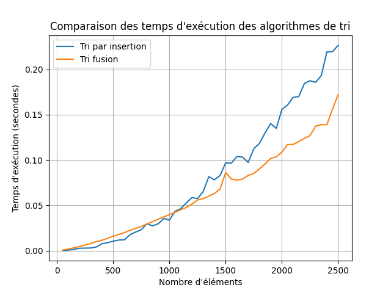
Le tri par insertion est effectivement plus rapide que le tri fusion sur des listes contenant moins de 1000 éléments mais la tendance s'inverse fortement par la suite, on retrouve le même phénoméne avec le tri par sélection:
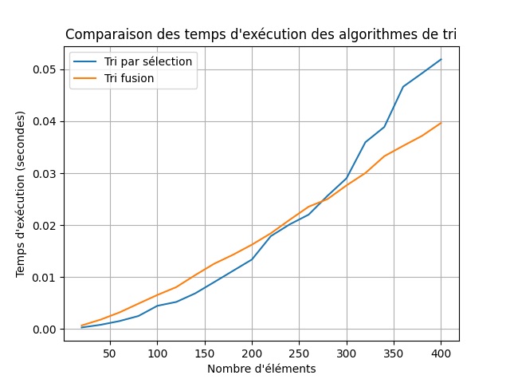

### Tri rapide
Le tri rapide consiste en le partitionnement de la liste afin de placer des éléments pivots, déjà à leur place définitive pour rediviser la liste encore et encore.
- **Complexité Temps** : O(nlog(n))
- **Complexité Mémoire** : O(log(n))
- **Avantages** : Très rapide.
- **Inconvénients** : Compléxité accrue si le pivot est mal choisi. 


```pseudo
partitionner(tableau T, entier premier, entier dernier, entier pivot)
    échanger T[pivot] et T[dernier]  // échange le pivot avec le dernier du tableau , le pivot devient le dernier du tableau
    j := premier
    pour i de premier à dernier - 1 // la boucle se termine quand i = (dernier élément du tableau).
        si T[i] <= T[dernier] alors
            échanger T[i] et T[j]
            j := j + 1
    échanger T[dernier] et T[j]
    renvoyer j
```
```pseudo
tri_rapide(tableau T, entier premier, entier dernier)
        si premier < dernier alors
            pivot := choix_pivot(T, premier, dernier)
            pivot := partitionner(T, premier, dernier, pivot)
            tri_rapide(T, premier, pivot-1)
            tri_rapide(T, pivot+1, dernier)
```
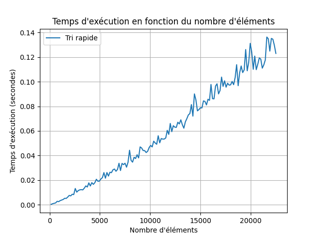
On observe ici que le tri rapide est extrèmement efficace sur de grandes listes et a une évolution presque linéaire en fonction du nombre d'éléments dans la liste. Cependant la vitesse de l'algorithme est très dépendante du bon choix du pivot, ce qui peut expliquer les irrégularités dans les mesures de temps pour les listes à 15 000 éléments et plus.

## Comparaison des algorithmes
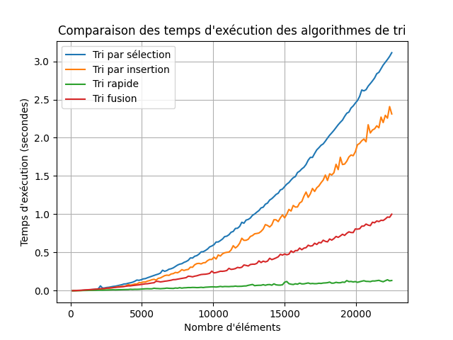
En ce servant des précédents résultat il était à prévoir que l'algorithme le plus constant et le plus efficaces étaient le tri rapide, c'est d'ailleurs la méthode de tri la plus utilisé si on ne compte pas les algorithmes hybrides qui alternent entre plusieurs méthodes de tri en fonction du nombre d'élément par exemple.
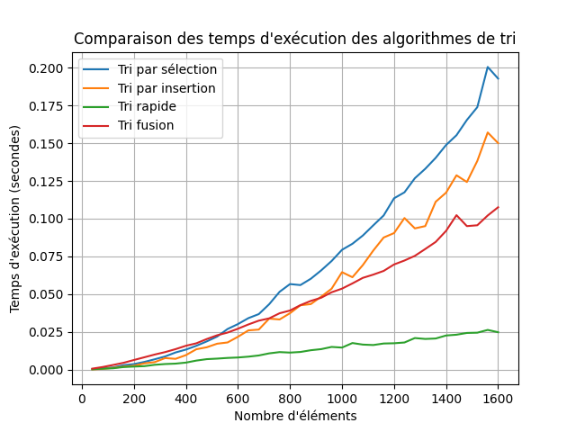

Aussi, jusqu'ici le cas oû la liste serai déjà trié n'a pas été traité, cependant cela est important à prendre en compte puisque certains résultats changent radicalement: 
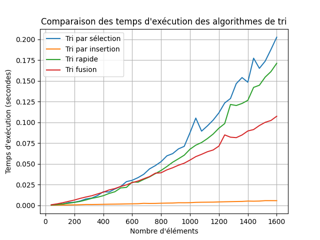
Certains algorithme sont très efficaces dans le cas oû la liste est déjà triées, notemment le tri par insertion, alors que d'autres très efficaces dans des situations normales deviennent d'un coup très lent par rapport aux autres comme le tri rapide. Dans certains cas il peut alors être utile d'utiliser un prédicat afin de vérifier si la liste est déjà triée ou partiellement triée dés le début de l'algorithme.

## Comparaison avec la méthode sort() de Python
Python met a disposition une méthode de tri hybride via la méthode sort() de la classe List ou la fonction sorted() qui renvoit une nouvelle liste triée en conservant la liste initiale en mémoire.
Le tri fusion consiste comme son nom l'indique en la fusion de petite liste triée chacune séparemment en utilisant la récursivité.
- **Complexité Temps** : O(nlog(n))
- **Complexité Mémoire** : O(n)
- **Avantages** : Efficace sur les grandes listes, efficace sur des listes déjà triées ou presque déjà triées, inclus dans Python par défaut.
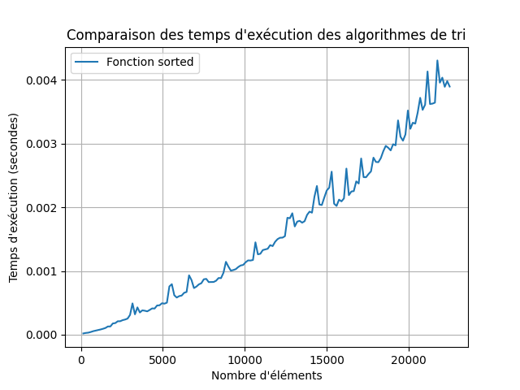
Le temps d'éxécution de cette fonction est extrêment bas, cela s'explique notemment car la fonction est écrite en C et permet donc des optimisations bas niveau non réalisées sur les fonctions écrites en Python.
Il s'agit d'une solution simple et sans doute la meilleure pour trier des listes en Python.
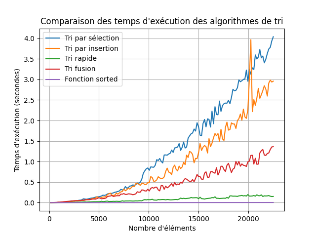

Sources:
```
https://fr.wikipedia.org/wiki/Tri_par_s%C3%A9lection
https://fr.wikipedia.org/wiki/Tri_par_insertion
https://fr.wikipedia.org/wiki/Tri_fusion
https://fr.wikipedia.org/wiki/Tri_rapide
https://docs.python.org/fr/3/howto/sorting.html
```